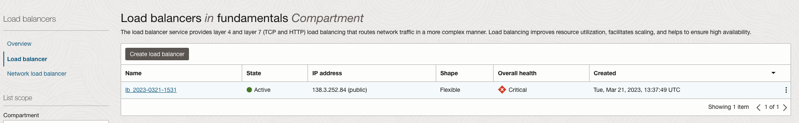
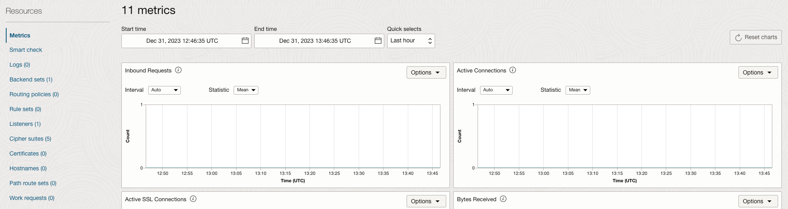
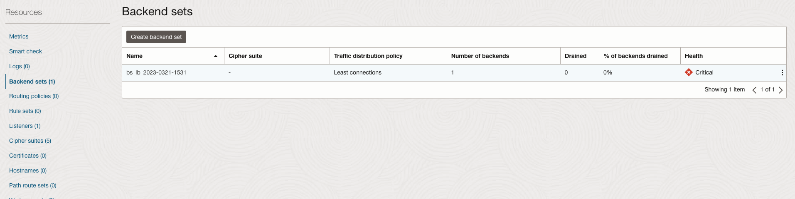
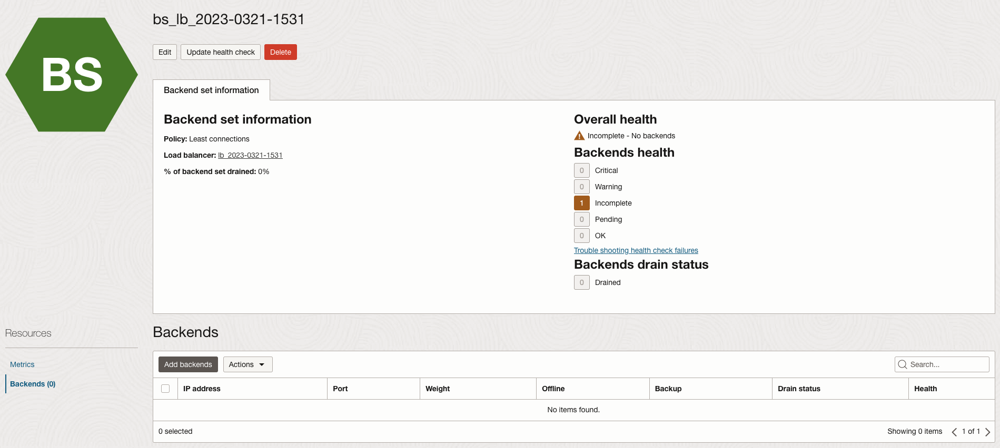
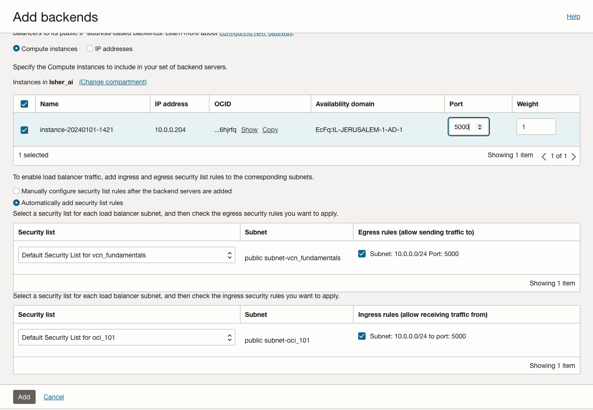
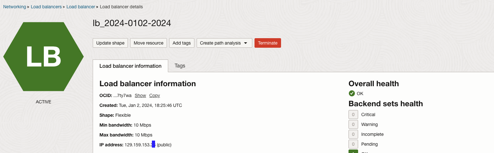

# Creating Load Balancer

1. Open the navigation menu and click **Networking** &rarr; **Load Balancer**

2. Click on the balancer you have created:

3. Click on "Backend sets" on the left side

     

4. Click on the created backend

    

5. Click on "Backends" on the left side

     

6. Click "Add Backend".

7. Select the backend from the list and set the port to "5000", 

    

8. leave it on "Automatically add security list rules" and click "Add"

9. Wait for the Load Balancer to change

10. Go back using the breadcrumbs to the LB and copy the IP address

    

11. open a browser and navigate to the url : http://{ip_address}

12. the website should be open via port 80.

