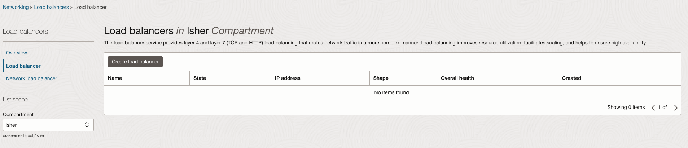
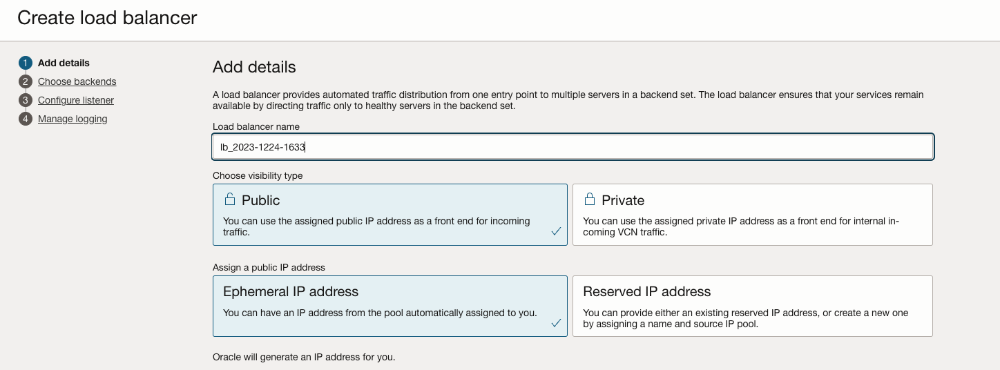
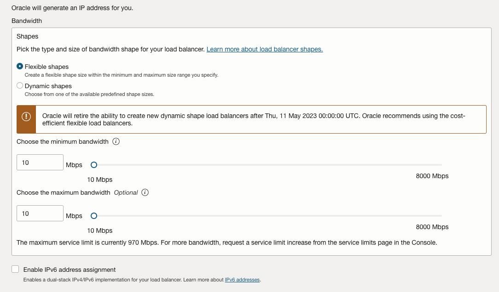
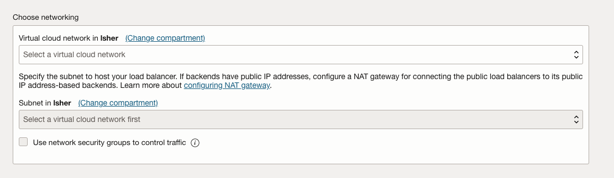
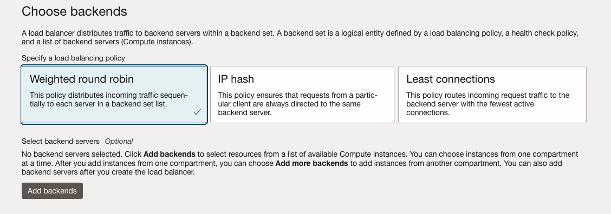
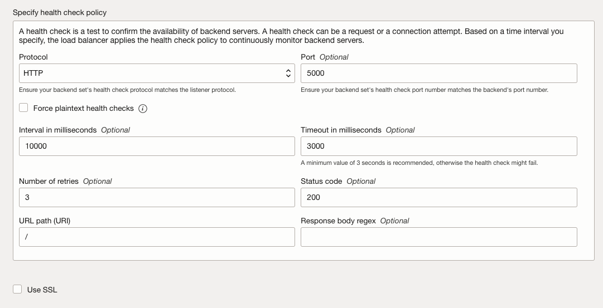
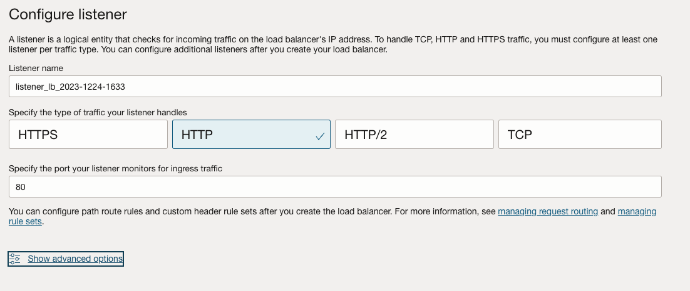
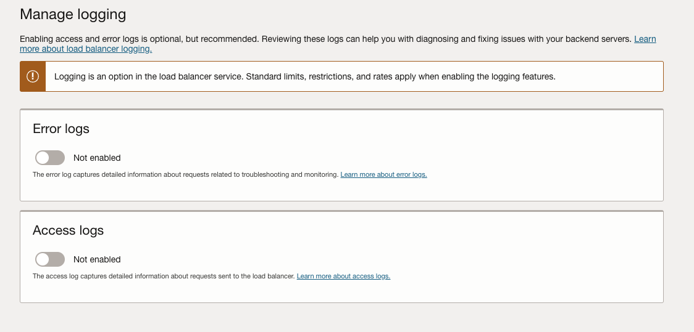

# Creating Load Balancer

1. Open the navigation menu and click **Networking** &rarr; **Load Balancer**

2. Click on **Create Load Balancer**

3. Fill the name of load balancer, select "Public" and "Ephemeral"

     

4. Leave shape settings as default.

    

5. Choose the network you created in before.

     

6. Click "Next" at the bottom.

7. Leave backends empty for now

    

8. Set the port to "5000".

    

9. Click "Next" at the bottom.

10. Select "HTTP" and specify the port as "80".

    

11. Disable the "error log"

    

12. Click "Submit" at the bottom.

Now you have created you first LB.

After the server will be ready we will connect backends to it.
